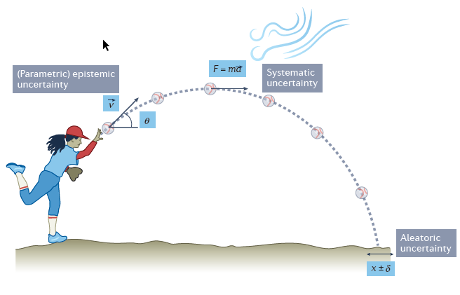
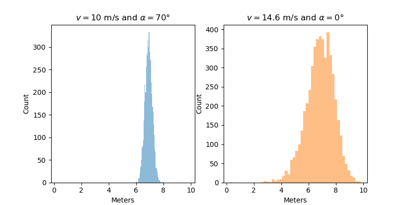
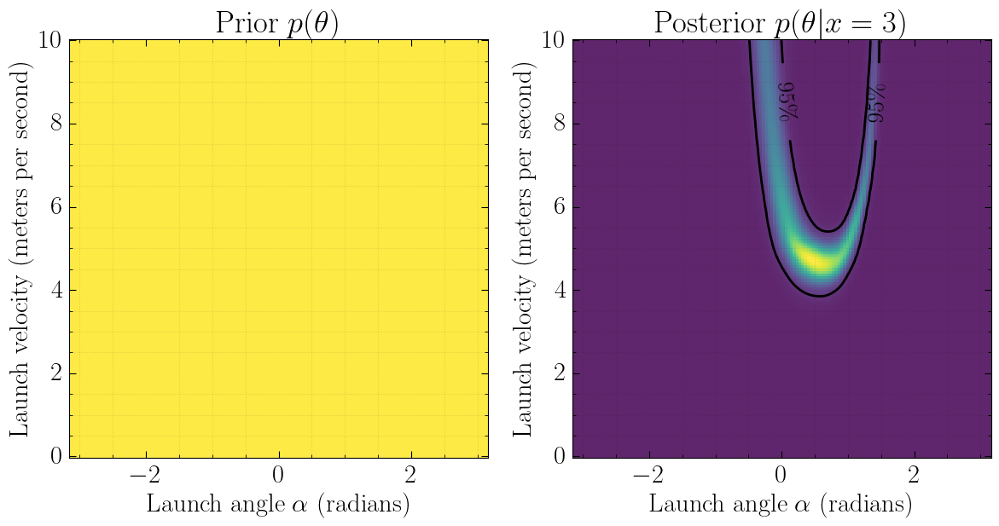
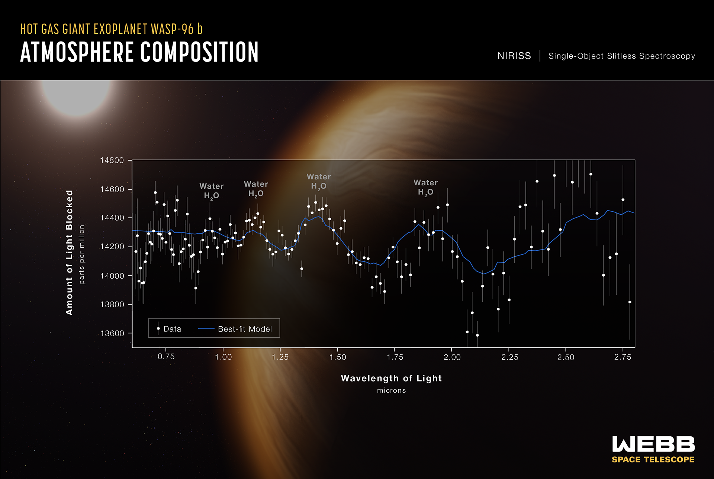
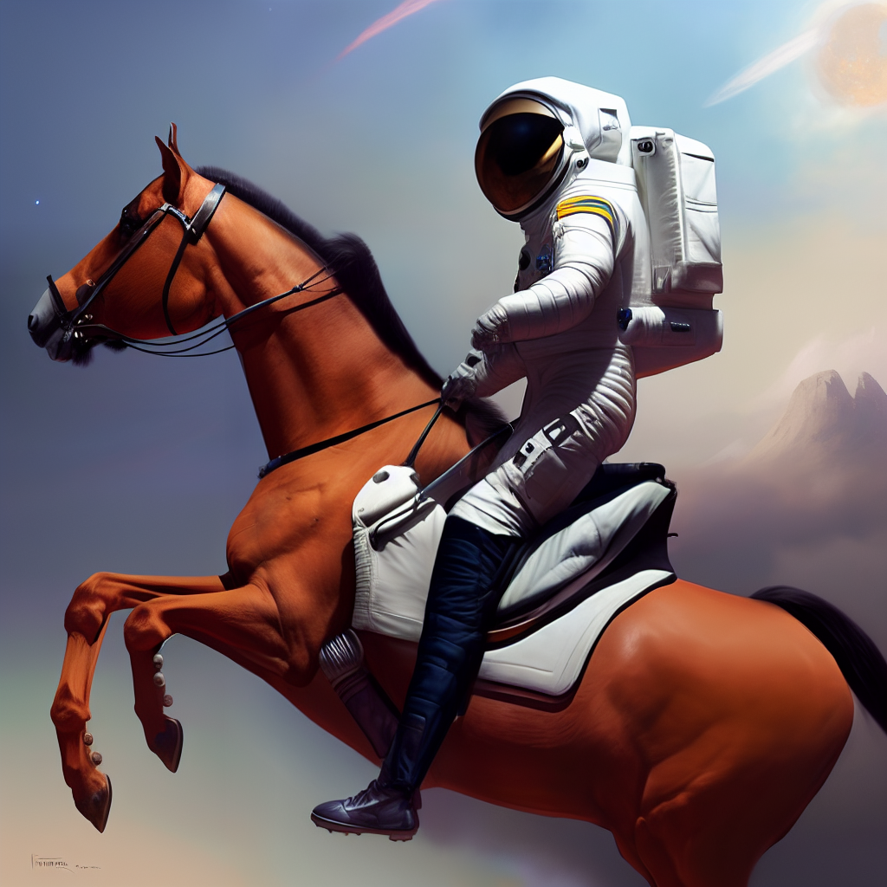
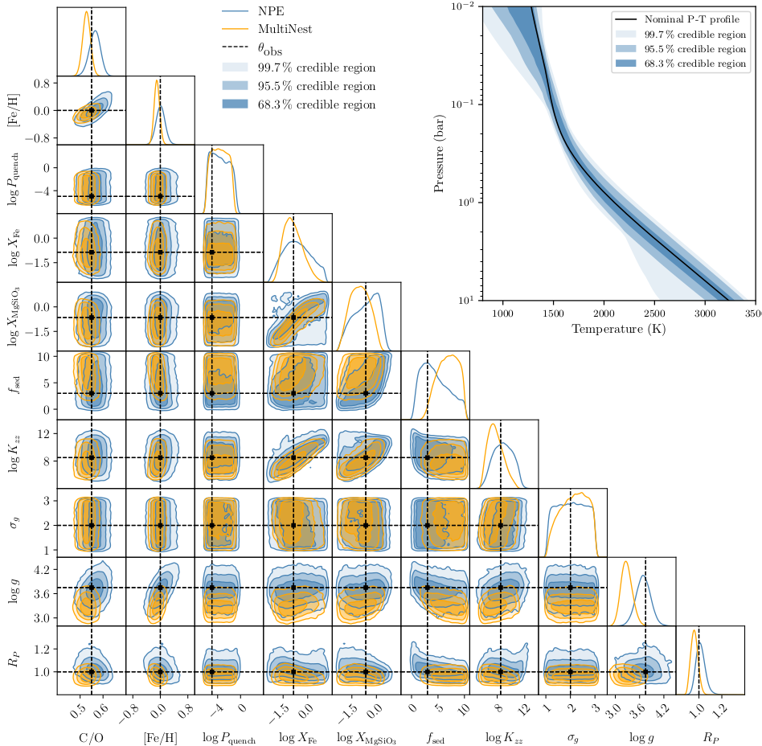

class: middle, center, title-slide
count: false

# Exoplanet atmospheric retrieval <br>with deep learning 

Part 2/2

<br>

Olivier Absil, Gilles Louppe

---

class: middle, center

.center.width-80[]

---

class: middle

$$
v_x = v \cos(\alpha),~~ v_y = v \sin(\alpha),
$$

$$
\frac{dx}{dt} = v_x,~~\frac{dy}{dt} = v_y, \frac{dv_y}{dt} = -G.
$$

---

class: middle

```python
def simulate(v, alpha, dt=0.001):
    v_x = v * np.cos(alpha)  # x velocity m/s
    v_y = v * np.sin(alpha)  # y velocity m/s
    y = 1.1 + 0.3 * random.normal()
    x = 0.0

    while y > 0: # simulate until ball hits floor
        v_y += dt * -G  # acceleration due to gravity
        x += dt * v_x
        y += dt * v_y

    return x + 0.25 * random.normal()
```

---

class: middle, center

.center.width-100[]

---

class: middle, center

.center.width-100[]

---

class: middle, center

What parameter values $\theta$ are the most plausible given $x\_\text{obs}$?

---

class: middle, center

.center.width-100[]

.center.width-75[]


---

class: middle, center

$$p(\theta|x\_\text{obs}) = \frac{p(x\_\text{obs} | \theta)p(\theta)}{p(x\_\text{obs})}$$

---

class: middle

.center.width-100[]

---

class: black-slide
background-image: url(./figures/wasp.jpg)

---

class: black-slide, middle

.center.width-100[]

---

class: middle, center

.center.width-100[]

.center.width-75[]

---

class: middle, center

.center.width-100[]

---

class: middle, black-slide

\> Input: "An astronaut riding a horse on a distant planet"<br>
Ouput: 

.center.width-50[]


---

exclude: true
class: middle, center

.center.width-100[]

---

exclude: true
class: middle, center

$$
\begin{aligned}
&\min\_{q\_\phi} \mathbb{E}\_{p(x)}\left[ \text{KL}( p(\theta|x) || q\_\phi(\theta|x) ) \right]
\end{aligned}$$

---

class: middle

.avatars[]

.center.width-100[]

---

class: middle

.avatars[]

<br>
.center.width-80[]

---

class: middle

## So what?

- Deep learning can be used to inverse models of exoplanet atmospheres.
- Inference time reduces from days/weeks to minutes, enabling large-scale surveys.
- Sophisticated models can be tested, without making compromises.

---

class: middle, black-slide

.center[
.width-100[]
]